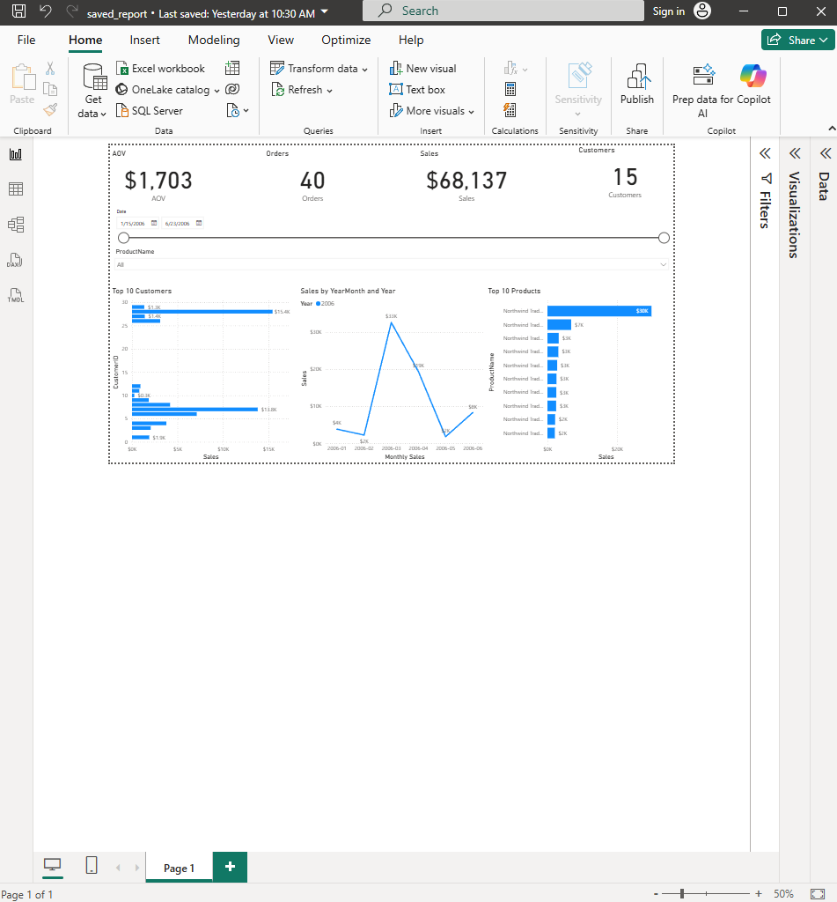
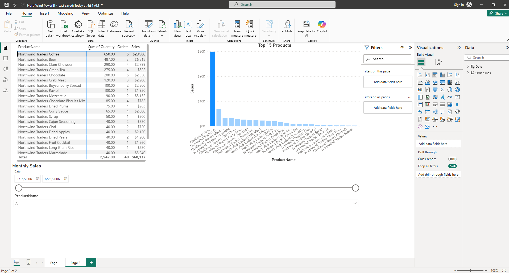

Northwind Sales Analysis
================================

A small, reproducible analytics project that extracts order line data from a Northwind MySQL database (or prebuilt CSVs), computes key KPIs, and produces clear visuals. It’s designed to be easy to run for reviewers while also showing the end‑to‑end ETL steps.

Overview
--------------------------------
- Problem: turn raw transactional data into monthly revenue trends, AOV, top customers, and top products — plus a few extra exploratory charts.
- Approach: robust SQL extraction from MySQL to a clean CSV; Pandas for KPIs; Matplotlib for plots. Cells are organized so the visuals can run even without a database.
- Deliverables: processed CSVs in `data/processed/` and PNG figures in `figures/`.

Executive Summary
--------------------------------
This project converts Northwind order lines into executive‑ready KPIs and visuals suitable for day‑to‑day decision making. Using the included processed sample (Jan–Jun 2006), here are the headline takeaways and recommended actions:

- Key findings (sample window)
  - Seasonality: strong revenue spike in March–April relative to Jan–Feb, then a sharp dip in May, partial recovery in June. See `figures/monthly_revenue.png` and `figures/monthly_revenue_ma.png`.
  - AOV outlier: March shows the highest Average Order Value (~$4,076), indicating either larger baskets or higher‑priced items in that month. See `data/processed/kpi_aov_by_month.csv` and `figures/monthly_revenue.png` for context.
  - Revenue concentration: the Top‑10 customers account for ~91% of revenue in this sample; CustomerID 28 is the largest contributor. See `data/processed/kpi_top_customers.csv` and `figures/top_customers.png`.
  - Product mix: “Northwind Traders Coffee” is the leading product (~$29.9k), with a long tail across other staples (Beer, Marmalade, Mozzarella). See `data/processed/kpi_top_products.csv` and `figures/top_products.png`.
  - Patterns to explore: weekday revenue (pivot) and top‑5 products per month suggest operational rhythms and mix shifts; inspect `figures/revenue_by_weekday.png` and `figures/monthly_top5_products_area.png`.

- Recommendations
  - Customer focus: prioritize retention/cross‑sell for the Top‑10 customers (high concentration risk); build watchlists and outreach cadences.
  - Inventory and promo planning: ensure availability and promotional support for the top products (especially Coffee) ahead of seasonal peaks.
  - Capacity planning: staff and stock ahead of March–April; monitor post‑peak months for demand normalization.
  - Pricing/discount checks: review discounting vs. realized line value (`figures/discount_vs_linevalue.png`) to confirm margin discipline.

Notes
- The above reflects the included CSV snapshot (Jan–Jun 2006). Running the ETL against a different Northwind instance may change exact figures while preserving the same workflow and visuals.
- All charts are reproducible from `northwind_analysis.ipynb` or `northwind_analysis.py`; refreshed outputs are saved to `figures/` and `data/processed/`.

Power BI Report
--------------------------------
This repo includes a compact, hiring‑manager‑friendly Power BI presentation built on the same Northwind dataset. It demonstrates clean modeling, core DAX, and day‑to‑day report building.

- Files:
  - PBIX: [NorthWind PowerBI.pbix](PowerBI/NorthWind%20PowerBI.pbix) — Import model with data embedded; opens without MySQL.
  - PDF: [NorthWind PowerBI.pdf](PowerBI/NorthWind%20PowerBI.pdf) — Snapshot of the report for quick review.
- Pages:
  - Overview — KPIs (Sales, AOV, Orders, Customers), Date/Product slicers, Monthly Sales line, Top‑10 Products/Customers.
  - Products — Product matrix (Sales, Quantity, Orders) and Top‑15 Products chart.
- Modeling & Measures:
  - Dedicated `Date` table (marked as a date table) related 1→* to `OrderLines[OrderDate]`.
  - Measures: `Sales`, `Orders`, `Customers`, `AOV`, plus basic time intelligence (MoM%, YTD optional).
- Screenshots (quick peek):

  

  

Notes
- Report is saved in Import mode so reviewers can open the PBIX without configuring a gateway.
- To refresh from MySQL instead: update credentials in Desktop and publish with an on‑premises gateway.
  
Tip: When viewing locally in VS Code, use “Open Preview” (Ctrl+Shift+V) to see images and links rendered.

Data Source
--------------------------------
- Schema/data: official Northwind sample (MySQL). The exact files used are included:
  - `data/db/northwind.sql` (schema)
  - `data/db/northwind-data.sql` (data)
- Setup method used: imported both files in MySQL Workbench (File → Open SQL Script → Execute), which creates a `northwind` schema and loads sample data.

Who It’s For
--------------------------------
- Analysts/engineers who want a quick, clean dataset for revenue KPIs.
- Hiring managers reviewing data skills without having to configure a DB (CSV mode works out of the box once CSVs are generated).
- Anyone who wants a minimal, readable reference for ETL → KPIs → charts.

Repository Contents
--------------------------------
- `northwind_analysis.ipynb` — main notebook (ETL, KPIs, plots; also extra exploratory cells).
- `northwind_analysis.py` — script fallback with the same logic (for editors that don’t open notebooks).
- `data/db/` — Northwind MySQL schema and data SQL files.
- `data/processed/` — generated CSVs (created by the notebook).
- `figures/` — generated PNG charts (created by the notebook).
 - `sql/` — MySQL “SQL Showcase” (view setup + KPI/analysis queries).

Requirements
--------------------------------
- Python 3.10+
- Jupyter (VS Code + Jupyter extension or classic Jupyter)
- Python packages:
  - `pandas==2.2.2`
  - `matplotlib==3.9.0`
  - `mysql-connector-python==8.4.0`

You can install them either by running the first cell in the notebook (`%pip install ...`) or via pip:

```
pip install pandas==2.2.2 matplotlib==3.9.0 mysql-connector-python==8.4.0
```

Quick Start (CSV Mode)
--------------------------------
No database is required to view charts if the CSVs are already present.
- Open `northwind_analysis.ipynb` and run from the plotting cells onward.
- Or run the script `northwind_analysis.py` cell by cell in VS Code (look for the `# %%` markers).
- Outputs are saved to `figures/` and `data/processed/`.

If `data/processed/order_lines.csv` does not exist yet, run the ETL cells (Cell 2–3) to create it.

Full Pipeline (DB Mode via MySQL Workbench)
--------------------------------
1. Load the Northwind database locally:
   - Open MySQL Workbench.
   - File → Open SQL Script → select `data/db/northwind.sql` → Execute.
   - File → Open SQL Script → select `data/db/northwind-data.sql` → Execute.
   - This creates schema `northwind` and loads data.
2. Open `northwind_analysis.ipynb` and update connection details if needed (default is below):
   - `HOST="127.0.0.1"`, `PORT=3306`, `USER="root"`, `PASSWORD="Password"`, `DB="northwind"`.
3. Run Cells 1→3 to extract and build CSVs; then run the plotting cells.

SQL Showcase (MySQL Workbench)
--------------------------------
Run the same KPIs directly in MySQL (no Python needed for this path). This highlights core SQL skills used in junior analyst roles.

What’s included
- `sql/00_setup.sql` — creates `vw_order_lines_enriched` view and a helpful date index.
- `sql/01_*.sql` … `sql/09_*.sql` — monthly revenue, AOV, top customers/products, Pareto, weekday pivot, top‑5 per month, moving average, and data quality checks.

Prerequisites
- MySQL 8 or later running locally.
- `northwind` schema loaded (see “Full Pipeline” above). If you already see `northwind` in Workbench with tables like `orders`, `order_details`, and `products`, you do not need to re‑import.

Step‑by‑step in MySQL Workbench
- Ensure the database is present:
  - In the Schemas panel, confirm `northwind` exists and contains tables.
  - If missing, import once: File → Open SQL Script → `data/db/northwind.sql` → Execute, then `data/db/northwind-data.sql` → Execute.
- Create the analytics view and index (safe to re‑run anytime):
  - Open `sql/00_setup.sql` → Execute. This creates `vw_order_lines_enriched` and adds `orders(order_date)` index if not present.
- Run KPI queries and view results:
  - Open any of `sql/01_*.sql` … `sql/09_*.sql` (e.g., `sql/01_kpi_monthly_revenue.sql`) → Execute.
  - The result grid shows the KPI table (e.g., month, revenue, moving average).
- Export results to CSV (optional):
  - Right‑click the result grid → Export Resultset → CSV → save under `data/processed/` (e.g., `data/processed/sql_kpi_monthly_revenue.csv`).

Query ↔ Chart/Metric mapping
- `sql/01_kpi_monthly_revenue.sql` → monthly revenue; also computes a 3‑month moving average.
- `sql/02_kpi_aov_by_month.sql` → average order value by month.
- `sql/03_top_customers.sql` → top N customers by revenue (edit `@limit`).
- `sql/04_top_products.sql` → top products by revenue.
- `sql/05_pareto_products.sql` → Pareto (80/20) by product.
- `sql/06_weekday_revenue_pivot.sql` → weekday revenue pivot.
- `sql/07_top5_products_per_month.sql` → monthly top‑5 products.
- `sql/08_moving_average.sql` → monthly revenue with 3‑month moving average.
- `sql/09_quality_checks.sql` → quick data quality checks (nulls, ranges, orphans, duplicates).

What this demonstrates (SQL skills)
- CTEs (`WITH`, `WITH RECURSIVE`) to generate complete month ranges.
- Window functions for moving averages, ranks, and running totals.
- Conditional aggregation for simple pivot tables.
- Practical indexing and reading query plans (`EXPLAIN` in Workbench) for performance awareness.

Notes
- All SQL queries are read‑only; they do not modify data. `sql/00_setup.sql` creates a view and an index only.
- SQL outputs mirror the KPIs computed in the notebook so reviewers can see both approaches (SQL‑first or CSV→Pandas).

Configuration
--------------------------------
- Connection settings live near the top of Cell 2 in the notebook (and in the script).
- The extractor auto‑detects table/column names for common Northwind variants, so you don’t need to edit SQL manually.

Outputs
--------------------------------
- CSVs (created by Cell 2–3):
  - `data/processed/order_lines.csv` — order lines with `OrderDate`, `CustomerID`, `ProductID/ProductName`, `UnitPrice`, `Quantity`, `Discount`, and `line_total`.
  - `data/processed/kpi_monthly_revenue.csv` — monthly revenue.
  - `data/processed/kpi_aov_by_month.csv` — average order value by month.
  - `data/processed/kpi_top_customers.csv` — top customers by revenue.
  - `data/processed/kpi_top_products.csv` — top products by revenue.
- Figures:
  - `figures/monthly_revenue.png`, `figures/top_customers.png`, `figures/top_products.png`, `figures/order_value_distribution.png`
  - Additional exploratory: moving average, Pareto, stacked area, weekday pattern, and baseline forecasts.

Data Dictionary (order_lines.csv)
--------------------------------
- `OrderID` (int): Unique identifier of the order.
- `OrderDate` (date): Order date, normalized to date (no time).
- `CustomerID` (int, nullable): Customer identifier (may be null in some rows).
- `ProductID` (int): Product identifier for the line item.
- `ProductName` (string, optional): Product name when available in the schema.
- `UnitPrice` (decimal): Unit price of the item on this order.
- `Quantity` (numeric): Quantity ordered for the line.
- `Discount` (numeric): Discount rate applied to the line (0–1).
- `line_total` (decimal): Computed as `UnitPrice * Quantity * (1 - Discount)`.

How the CSV Was Created (SQL)
--------------------------------
The extractor builds a `SELECT` based on your actual column names. For the included Northwind schema, it’s equivalent to:

```
SELECT
  o.id AS OrderID,
  DATE(o.order_date) AS OrderDate,
  o.customer_id AS CustomerID,
  od.product_id AS ProductID,
  od.unit_price AS UnitPrice,
  od.quantity AS Quantity,
  COALESCE(od.discount, 0) AS Discount,
  (od.unit_price * od.quantity * (1 - COALESCE(od.discount, 0))) AS line_total,
  p.product_name AS ProductName
FROM northwind.orders o
JOIN northwind.order_details od ON o.id = od.order_id
JOIN northwind.products p ON od.product_id = p.id;
```

This result is saved as `data/processed/order_lines.csv`. KPIs are computed from there using Pandas.

Notes & Limitations
--------------------------------
- The dataset is small and synthetic; forecasts included in the extra cells are simple baselines (naive/seasonal‑naive) intended for illustration.
- If your editor highlights `import mysql.connector` with a warning, ensure your VS Code interpreter matches the Jupyter kernel, or install the packages into that interpreter. The notebook still runs as long as the kernel has the dependencies.

Troubleshooting
--------------------------------
- “Editor could not be opened”: if your IDE won’t open `.ipynb`, use `northwind_analysis.py` which mirrors the notebook and can be executed cell‑by‑cell in VS Code.
- `pandas.read_sql` warning: pandas prefers SQLAlchemy engines, but `mysql-connector-python` works; the warning is informational.
- Connection errors: verify MySQL is running and that `HOST/PORT/USER/PASSWORD/DB` match your local setup.

---
